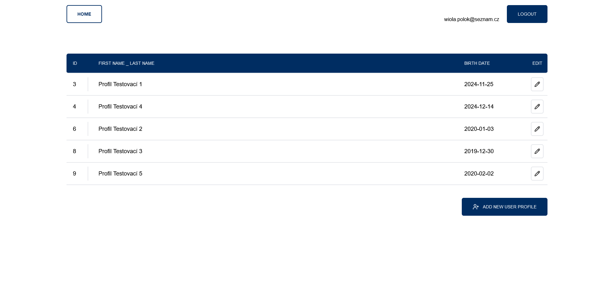
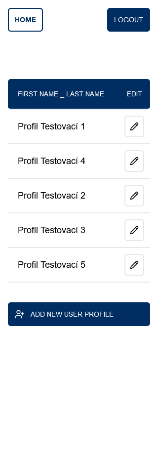
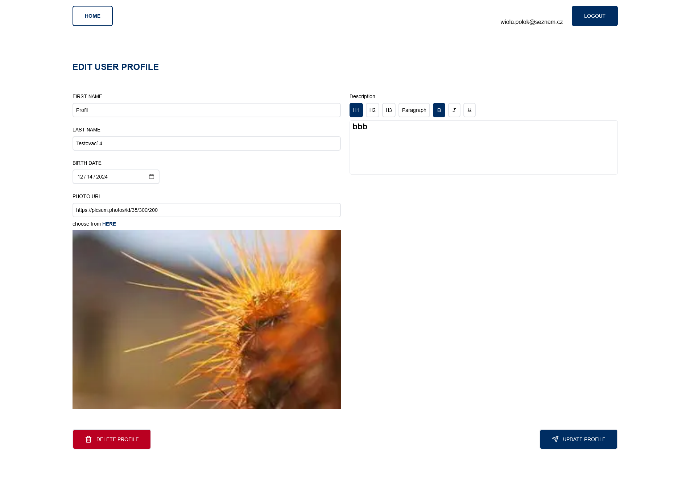
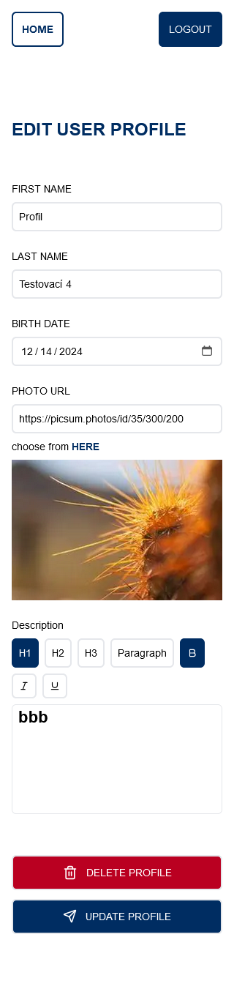

# Users Profiles App

This is a Next.js application that allows managing user profiles, allowing admin users to create, edit and delete personal information securely.

## Live demo [_here_](https://users-profiles-six.vercel.app/)

Enter your email address and password to log in. If an account with that email doesn’t exist it will be created automatically.

## Table of Contents

- [Features](#features)
- [Technologies Used](#technologies-used)
- [Screenshots](#screenshots)
- [Getting Started](#getting-started)
  - [Prerequisites](#prerequisites)
  - [Installation](#installation)
  - [Running the Application](#running-the-application)
- [API](#api)
- [Folder Structure](#folder-structure)
- [Contact](#contact)

## Features

- Fetching user profiles from Mysql database
- Login admin accounts
- Creating admin accounts
- Modifying user profiles
- Adding and removing user profiles
- Creating profile description using rich text editor

## Technologies Used

- Next.js
- TypeScript
- Tailwind CSS
- Prisma ORM
- Next Auth
- Tiptap editor

## Screenshots






## Getting Started

### Prerequisites

Make sure you have the following installed on your machine:

- [Node.js](https://nodejs.org/) (version 14 or later)
- [npm](https://www.npmjs.com/get-npm) (comes with Node.js)

### Installation

1.  Clone the repository:

    ```bash
    git clone https://github.com/Wiolinek/users-profiles.git
    ```

2.  Install the dependencies:

    ```bash
    cd users-profiles-app
    npm ci
    ```

3.  Set up env variables:

    DATABASE_URL= mysql connection string

    AUTH_SECRET= to generate a random string, you can use the Auth.js CLI: npx auth secret

### Running the Application

```bash
npm run dev
```

application is running on http://localhost:3000

## API

The application fetches data from the Mysql database using Prisma ORM:

## Folder Structure

Here's an overview of the project's folder structure:

    /users-profiles-app
        ├── /actions                   # Server-side actions
        ├── /app                       # Application folder (Next.js app directory)
        ├── /components                # Reusable components
        ├── /lib                       # Libraries and utilities
        ├── /prisma                    # Prisma ORM schema
        ├── /public                    # Static files and assets
        ├── /types                     # TypeScript interfaces
        ├── /utils                     # Helper utility functions
        ├── auth.ts                    # Auth configuration
        ├── next.config.ts             # Next.js configuration
        ├── package.json               # NPM package configuration
        ├── README.md                  # Project documentation
        └── tsconfig.json              # TypeScript configuration

## Contact

Created by [@Wiolinek](https://github.com/Wiolinek) - feel free to contact me!
